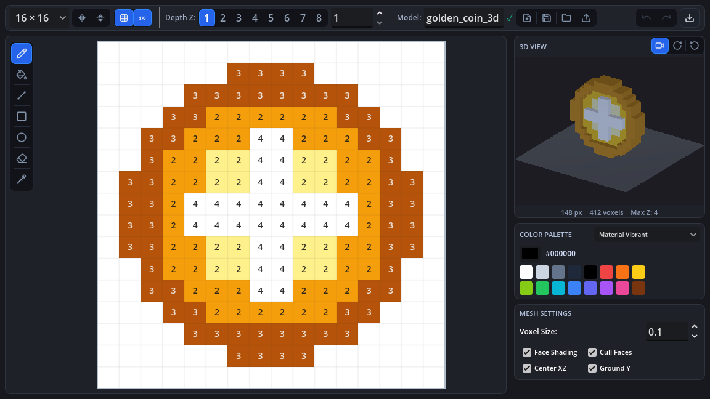

# Pixel Mesh 3D Builder

A Godot 4.x editor plugin for creating low-poly 3D voxel models, characters, and assets directly within the engine using an interactive 2D canvas or by importing PNG sprites.


[](LICENSE)
[](https://ko-fi.com/leonsivana)



---

## Features

- **Interactive Canvas**: Paint pixels on customizable grids (8x8, 16x16, 24x24, 32x32).
- **Sprite Importer**: Load transparent PNG images and convert them into 3D meshes.
- **Color Tools**: Eyedropper / Color Picker and pre-configured quick color palette.
- **Symmetry Tools**: Horizontal and vertical mirroring modes for character design.
- **Real-time 3D Preview**: Orbit, pan, and zoom camera with grid ground, wireframe toggle, and rotation controls.
- **Extrusion Profiles**: Flat, Beveled, Rounded, and Stepped mesh profiles.
- **Direct Export**:
  - Export as `.tscn` (ready-to-use scene).
  - Export as `.res` / `.tres` (ArrayMesh resource).
  - Export as `.obj` (3D model interchange format).
  - Save source files as `.json`.

---

## Installation

1. Copy the `pixel_mesh_builder` folder into your project's `res://addons/` directory:
   ```text
   res://addons/pixel_mesh_builder/
   ```
2. In Godot, navigate to **Project** -> **Project Settings** -> **Plugins**.
3. Enable **Pixel Mesh 3D Builder**.
4. The **Pixel Mesh** bottom panel will appear at the bottom dock of your editor.

---

## Support & Contributing

If you find this plugin helpful for your Godot projects, you can support its continued development:

- ⭐ **Star this repository** on GitHub to help more developers discover it!
- 🐛 **Report bugs & suggest features** via [GitHub Issues](https://github.com/leonsivanaDev/pixel-mesh-3d-builder/issues).
- ☕ **Support the developer**: [Buy me a coffee on Ko-fi](https://ko-fi.com/leonsivana) to support future updates and new features.

---

## License

This project is licensed under the **GNU General Public License v3.0**. See the [LICENSE](LICENSE) file for details.
